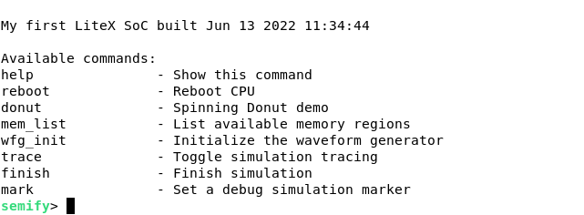
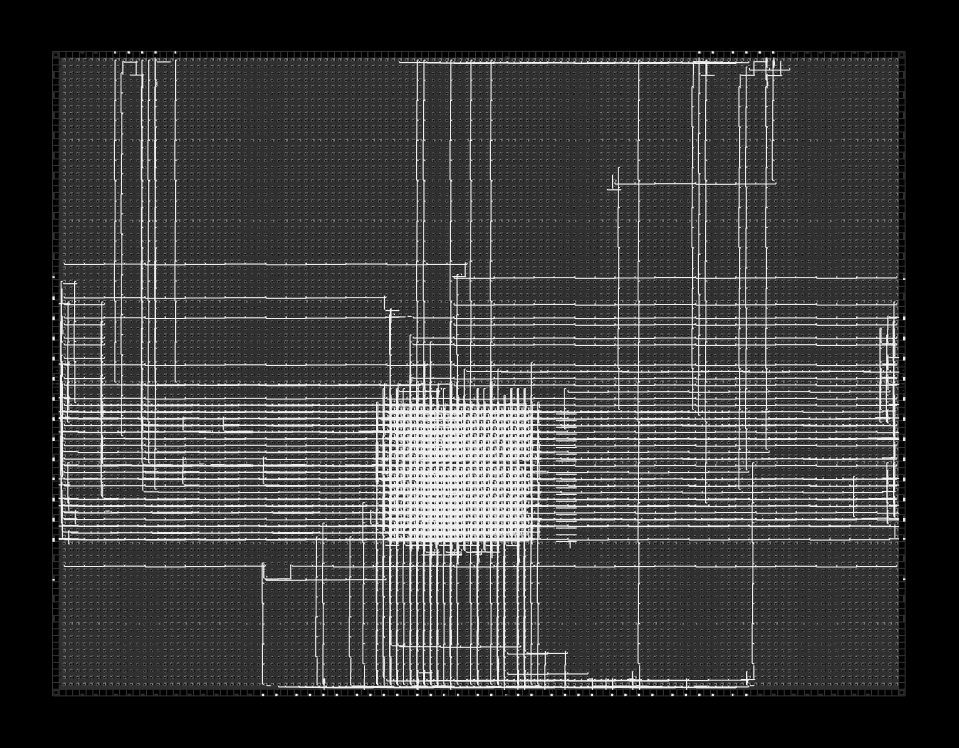

# Waveform Generator 

This repository implements a generic Waveform Generator in SystemVerilog.

## Introduction

The Waveform Generator is split up into three parts:

- Stimuli
- Interconnect
- Drivers

Currently the following components are available:

- `wfg_core`
- `wfg_subcore`
- `wfg_interconnect`
- `wfg_stim_sine`
- `wfg_stim_mem`
- `wfg_drive_spi`
- `wfg_drive_pat`

## Prerequisites

For this project you will need Python3+ and pip.

For the generation of the register files based on templates install `jinja2`:

    pip3 install jinja2

The testbench environment for the unit-tests uses `cocotb`. To install it together with the bus interfaces, run:

    pip3 install cocotb
    pip3 install cocotbext-axi
    pip3 install cocotbext-spi
    pip3 install cocotbext-wishbone

To plot the values during functional verification install the following modules:

	pip3 install scipy
	pip3 install numpy
	pip3 install matplotlib

To get more information on assertion fails you can optionally install `pytest`: 

	pip3 install pytest

## Simulation

To run the individual unit tests, issue:

	make tests

## Template Based Generation

To generate the register files for the wishbone bus, issue:

	make templates

## Code Formatting

To ensure consistent formatting, [verible](https://github.com/chipsalliance/verible) is used as a SystemVerilog formatter tool.

	make format

This will format the code according to some custom flags.

## Invoke Linter

To invoke the [verible](https://github.com/chipsalliance/verible) linter, run:

	make lint

## FPGA Prototyping with LiteX

To run the project on an FPGA, [LiteX](https://github.com/enjoy-digital/litex) is used to instantiate the SoC.

Follow the instructions on the GitHub page to install LiteX. After installation don't forget to add the RISC-V toolchain to the PATH variable.

To automatically generate documentation about the SoC, install:

	pip3 install sphinx sphinxcontrib-wavedrom

To trace the simulation using `--trace` you need to install:

    pip3 install pyvcd

### Simulation

To run the simulation with LiteX go to:

`fpga/ulx3s_soc`

First run

	make sim-prebuild

and after that finally:

	make sim

The output of the simulation window should be:

### FPGA Bitstream generation

To build the bitstream with LiteX for the ULX3S go to:

`fpga/ulx3s_soc`

First run

	make build-prebuild

and after that finally:

	make build

To upload the bitstream to the ULX3S board, run:

	make only-upload

## View FPGA Utilization

To view the FPGA utilization of only the Waveform Generator with nextpnr, issue the command:

	nextpnr-view

Next, a window will open. In the top menu, choose the following actions one after another:

- Pack
- Place
- Route

After this you can just take a screenshot of the finished design.

It will look like this:

## License

Copyright [semify](https://www.semify-eda.com/).

Unless otherwise specified, source code in this repository is licensed under the Apache License Version 2.0 (Apache-2.0). A copy is included in the LICENSE file.

Other licenses may be specified as well for certain files for purposes of illustration or where third-party components are used.
