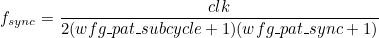

*Copyright © 2021* [Semify EDA](
https://github.com/semify-eda)

## wfg_subcore documentation
#### Overview
This module is responsible to synchronize all implemented modules, ensuring data transfers with a set frequency.
According to the configuration parameter wfg_pat_subcycle, clock cycles are counted and a subcycle pulse is generated. This subcycle enables finer division of the synchronization pulse and is used for synchronizations with phase shifts. The configuration parameter wfg_pat_sync specifies the number of subcycle pulses during a sync period. The resulting sync frequency 

can be determined using these two parameters. The outputs of the module are subcycle and sync pulses, as well as three optional status signals (active, start pulse, subcyle counter).